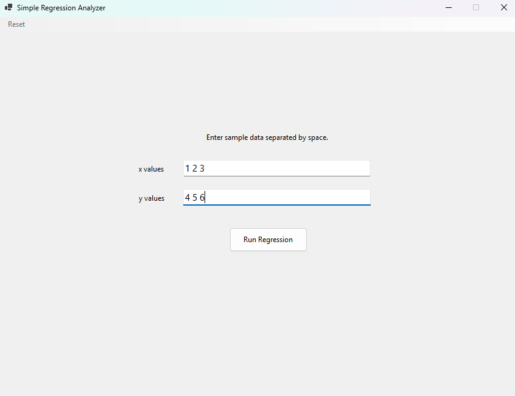

# Regression Analyzer

A program that **computes simple linear regression and makes predictions** from user-provided datasets.

**Features:**
- Accepts two sets of user inputs: `x` and `y`.  
- Calculates and displays slope, intercept, coefficients, and other intermediary values.  
- Shows the **regression equation** and the **null hypothesis test result**.  
- Predicts `y` values for new inputs after training the model.

**Technologies:**

**Demonstration:** C#, .NET WPF

